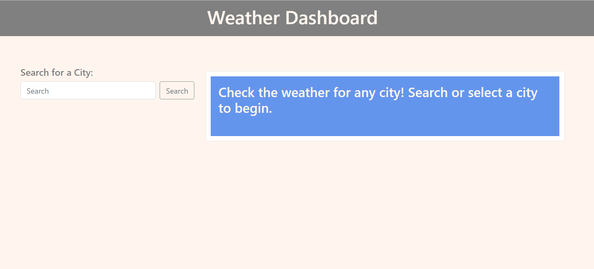
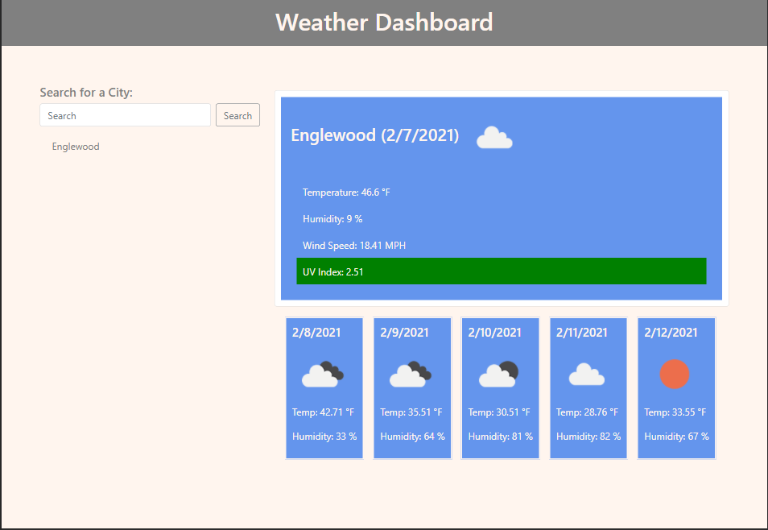

# 06 Server-Side APIs: Weather Dashboard

A project to introduce the concept of server-side api's through the implementation of a weather dashboard.

## Purpose and Scope

The purpose of this website is to allow a user to search for a city and view the weather forcast for the day as well as the next 5 days. 

The app is limited in scope in the following ways. First, at the moment there is no way to specify the State or Country of the city. Therefore searching a city brings up data for a city by that name and not necessarily within the desired State or Country.  Second, the ap only brings up weather for today and the next five days. It does not allow the user to look farther into the future or review weather from the past.

## Installation

No installation is required. This is a web-based ap. Click here to access it:
https://lasettebrown.github.io/6-server-side-apis-weather-dashboard/

## Instructions

When the site loads the user will be presented with instructions and a search bar.

The user may enter the name of a city into the search field and click the 'search' button. Doing so brings up the weather for the current day as well as the five day forcast. The user's search is saved and listed below the search bar.

The current weather contains the name of the city, the current date, an icon representing the weather (for a list of icons look here: https://openweathermap.org/weather-conditions#How-to-get-icon-URL), the current temperature, humidity, wind speed, and UV Index. The UV Index is color coded according to the risk level. (More information about UV Index is available here: https://en.wikipedia.org/wiki/Ultraviolet_index )

Below today's weather, five boxes appear showing the weather forcast for the next five days. 

Clicking on a previously searched city brings up the information about that city again.

## Built with

I used Luxon to access and format dates and times for this project. I used the Open Weather API for all weather and forcast information. I also used bootstrap and jQuery.

Find more information about OpenWeather here:
  * [OpenWeather API](https://openweathermap.org/api)

Find more information about Luxon here:
  * [Luxon](https://moment.github.io/luxon/)

## Authors

All HTML, CSS, Javascript, and Jquery were written entirely by Lasette Brown.

## License

The content of this website is copyrighted. Please do not use the content without permission.
© 2021 Lasette Brown. All Rights Reserved.

